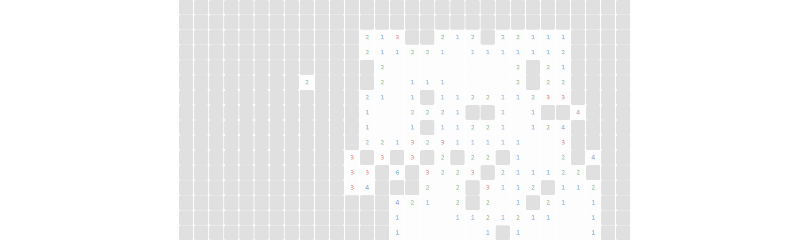

# Minesweeper + Solver (JavaFX)

A clean Minesweeper with a deterministic solver, first-click safety, save/load, and **seeded boards** for reproducible demos.  
Made by **Bossiq**.

---

## Features

- ⛳ **First-click safety** (mines placed after your first reveal; never the clicked cell)
- 🧠 **Deterministic solver**: Step (safe moves) and Auto (chains safe deductions)
- 👆 **Chording**: double-click or middle-click a number to auto-reveal neighbors when flags match
- 🚩 Flags, moves, timer, “mines left”
- 💾 **Save/Load** (`.msw` binary, versioned)
- 🎲 **Seeded games**: enter a number to get the same board again
- 📸 **Screenshot (F8)**: saves the grid as PNG
- 🧪 **Unit tests** (JUnit 5) & **CI** (Windows + Ubuntu)
- 📦 **Portable Windows build** via `jlink` (GitHub Release download)

---

## Controls

- **Left click**: reveal
- **Right click**: flag / unflag
- **Double-click / Middle click** on a number: chord (auto-reveal when flags match)
- **R**: restart (same difficulty)
- **S / A**: solver step / auto
- **C**: clear all flags
- **F5 / F9**: save / load
- **F8**: screenshot (PNG)

> Tip: If you placed uncertain flags, hit **C** before **Auto**. The solver assumes flags are correct for chording; wrong flags can cause a loss (like classic Minesweeper).

---

## Screenshots

> Use **Screenshot (F8)** to create these. Put PNGs in `docs/images/`.

| Beginner | Intermediate | Expert |
|---|---|---|
|  |  |  |

---

## Build & Run (local)

```bash
# run tests
./gradlew test

# run app
./gradlew run

# create portable runtime image (jlink)
./gradlew jlink
# Windows output: build/image/bin/minesweeper.bat

# optional: installer (if JDK includes jpackage)
./gradlew jpackage

```
## Downloads

- Windows (portable): Download latest

    Unzip → run bin/minesweeper.bat.
    (Windows SmartScreen may warn about unsigned binaries: More info → Run anyway.)

- macOS / Linux: no prebuilt archive yet. Run locally with ./gradlew run, or create a platform-specific image with ./gradlew jlink on that OS.
## Tech Stack
- Java 17, JavaFX 17
- Gradle, JUnit 5
- org.beryx.jlink (portable Windows build)
- GitHub Actions CI (Windows + Ubuntu)

## Architecture (short)
- **model** – `Board`, `Cell`, `Coord`, `GameStats` (pure logic; save/load; seedable RNG; first-click safety)
- **ui** – `BoardView` (JavaFX grid, controls, screenshots, auto-resize)
- **solver** – deterministic safe-move heuristics (no guessing)
- **App** – JavaFX bootstrap (Stage/Scene)

## Credits
- **Author:** Oboroceanu Marian ([@Bossiq](https://github.com/Bossiq)) — Maastricht, NL  
- **License:** MIT  
- **Acknowledgments:** Built for my GitHub portfolio, with implementation guidance from ChatGPT.
